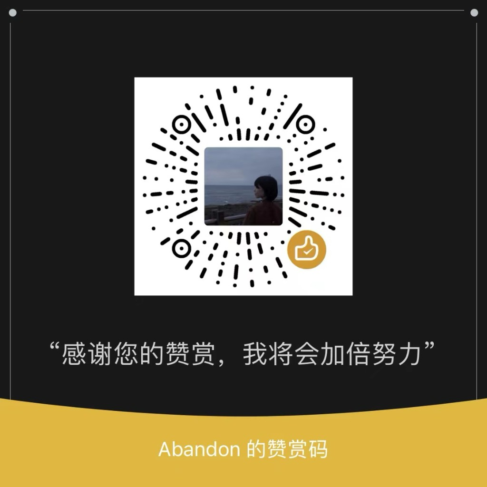

<div align="right">
  <a href="./README.md">简体中文</a> ｜
  <a href="./README_EN.md">English</a> ｜
  <a href="./README_JA.md">日本語</a> ｜
  <a href="./README_KO.md">한국어</a>
</div>

# EchoSelf

チャット履歴から会話データを抽出し、言語モデルをファインチューニングして、自分だけのAIデジタルツインを作成します。

> **⚠️ 重要なお知らせ**：本プロジェクトは**学習・研究目的のみ**を対象としています。使用前に、チャットデータに関係するすべての当事者から明示的な同意を得てください。また、お住まいの地域の法律・規制の範囲内でご利用ください。違法行為、権利侵害、またはプライバシーを侵害する目的での使用は禁止されています。

---

## 概要

EchoSelf は、完全ローカルで動作するGUIベースのチャット履歴処理・モデルトレーニングツールです。エクスポートしたチャット記録のJSONファイルをフォルダに入れるだけで、GUIを通じてデータのクリーニング・フィルタリング・匿名化・変換を行い、LLaMA-Factory に直接使用できるトレーニングデータセットを生成できます。モデルのダウンロードやワンクリックトレーニングも内蔵しています。

**すべてローカルで動作します。データはデバイスの外に出ません。**

---

## プロジェクト構成

```
echoself/
├── app.py                  # GUI エントリポイント（Gradio）
├── pyproject.toml          # 依存関係とプロジェクトメタデータ
├── README.md
├── models/                 # ローカルモデル保存ディレクトリ（実行時に生成）
├── src/
│   ├── __init__.py
│   ├── parser.py           # チャット記録解析レイヤー
│   ├── preprocessor.py     # データ処理レイヤー（フィルタ / 匿名化 / QAペア生成）
│   └── trainer.py          # トレーニングラッパー（LLaMA-Factory インターフェース + モデルダウンロード）
└── output/                 # 実行時に生成
    ├── sft_data.json       # 処理済みトレーニングデータ
    ├── dataset_info.json   # LLaMA-Factory データセット登録ファイル
    ├── train_args_snapshot.json  # トレーニング設定スナップショット（再現用）
    └── model/              # ファインチューニング済みモデル（LoRA アダプター）
```

---

## 入力データ形式

EchoSelf は **[WeFlow](https://github.com/re-collect-cn/weflow)** でエクスポートしたWeChatチャット記録のJSON形式に対応しています。各連絡先は個別の `.json` ファイルに対応し、構造は以下の通りです：

```json
{
  "session": {
    "wxid": "wxid_xxxxxxxxxx",
    "displayName": "相手の表示名",
    "nickname": "相手のニックネーム（予備）",
    "type": "プライベートチャット"
  },
  "messages": [
    {
      "localId": 1,
      "createTime": 1700000000,
      "formattedTime": "2023-11-15 10:00:00",
      "type": "テキストメッセージ",
      "content": "メッセージの内容",
      "isSend": 1,
      "senderUsername": "wxid_xxxxxxxxxx",
      "senderDisplayName": "あなたの名前",
      "quotedContent": null
    }
  ]
}
```

**フィールド一覧：**

| フィールド | 型 | 説明 |
|-----------|-----|------|
| `session.wxid` | string | 相手のWeChat アカウントID |
| `session.displayName` | string | 相手の表示名 |
| `session.type` | string | チャットの種類：`プライベート` / `グループ` |
| `messages[].isSend` | int | `1` = 自分が送信、`0` = 受信 |
| `messages[].type` | string | 対応形式：`テキスト`・`引用`；その他（画像・音声など）はフィルタリング |
| `messages[].content` | string | テキスト内容 |
| `messages[].senderUsername` | string | 送信者のアカウントID（自動検出に使用） |
| `messages[].quotedContent` | string\|null | 引用メッセージの元テキスト（引用のみ） |

> **エクスポート方法：** [WeFlow](https://github.com/re-collect-cn/weflow) などのツールを使ってWeChatチャット履歴をエクスポートします。各連絡先を個別の `.json` ファイルとして保存し、すべてのファイルを1つのフォルダにまとめてEchoSelfにインポートしてください。

---

## GUIタブ機能

### 📦 データ処理

- **ネイティブフォルダ選択**：「📂 フォルダを選択」をクリックするとシステムダイアログが開き、パスの手入力が不要
- **アカウントID自動検出**：フォルダ選択後、チャット記録をスキャンして送信メッセージからWeChatIDを自動検出
- 設定パラメータ：時間ウィンドウ、メッセージ長フィルタ、ブロックワード、システムプロンプト等
- 統計情報とデータプレビューを表示
- 生成したトレーニングデータファイル（`sft_data.json`）のダウンロード対応

### ⬇️ モデルダウンロード

- **ModelScope**（中国ユーザー向け、プロキシ不要）と **HuggingFace** の二重ソース対応
- プリセットモデルを選択するとモデルIDと保存先が自動入力
- ストリーミングダウンロードログ、途中停止に対応
- プリセットモデル一覧（M4メモリ使用量付き）：

| モデル | メモリ | Mac M4 16GB |
|--------|--------|-------------|
| Qwen2.5-0.5B-Instruct | ~2 GB | ✅ |
| Qwen2.5-1.5B-Instruct | ~4 GB | ✅ おすすめ |
| Qwen2.5-3B-Instruct | ~8 GB | ✅ |
| Qwen2.5-7B-Instruct | ~16 GB | ⚠️ メモリがほぼ満杯 |
| Qwen2.5-14B-Instruct | ~32 GB | ❌ |
| Llama-3.2-1B-Instruct | ~3 GB | ✅ |
| Llama-3.2-3B-Instruct | ~8 GB | ✅ |
| SmolLM2-1.7B-Instruct | ~4 GB | ✅ |
| Phi-3.5-mini-instruct | ~8 GB | ✅ |

### 🎯 モデルトレーニング

- ローカルのLLaMA-Factoryインストール状況を自動検出
- トレーニングハイパーパラメータフォーム（モデルパス、LoRA rank、学習率、Epochs 等）
- **Apple Silicon 自動最適化**：Mシリーズチップ検出時に `bf16` 精度へ自動切換、Flash Attention 無効化、MPSバックエンドを使用
- 実行前にフルトレーニングコマンドをプレビュー
- ワンクリックトレーニング、リアルタイムログストリーミング、途中停止に対応
- **リアルタイムLoss曲線**グラフとトレーニング健全性インジケーター（🟢 / 🟡 / 🔴）

### 💬 モデル対話

- ベースモデル + オプションのLoRAアダプターを読み込んで対話推論
- トークンごとのストリーミング応答に対応
- 設定可能項目：システムプロンプト、温度（temperature）、最大生成トークン数
- ワンクリックでモデルをアンロードしてGPU/MPSメモリを解放

### 📖 ヘルプドキュメント

- LoRA・SFT・bf16 などの技術用語解説
- トレーニング品質評価基準
- Apple Silicon パラメータ推奨値
- よくある質問（FAQ）とハードウェアリファレンス

---

## クイックスタート

### ステップ1 — 仮想環境の作成

```sh
cd echoself
uv venv .venv --python=3.12
source .venv/bin/activate
```

### ステップ2 — 依存関係のインストール

**中国国内ユーザー（清華ミラー、プロキシ不要）：**

```sh
uv pip install -e ".[all]" --index-url https://pypi.tuna.tsinghua.edu.cn/simple
```

**その他のユーザー：**

```sh
uv pip install -e ".[all]"
```

> `[all]` には以下が含まれます：`gradio` · `pandas` · `modelscope` · `huggingface-hub` · `llamafactory`（`torch` / `transformers` / `peft` / `trl` / `accelerate` / `datasets` 等のML依存関係を含む）

### 必要な機能だけをインストール

| ユースケース | コマンド |
|------------|---------|
| データ処理のみ | `uv pip install -e "."` |
| データ処理 + ModelScope ダウンロード | `uv pip install -e ".[modelscope]"` |
| データ処理 + HuggingFace ダウンロード | `uv pip install -e ".[huggingface]"` |
| フル機能（トレーニング含む） | `uv pip install -e ".[all]"` |

### ステップ3 — GUIを起動

```sh
.venv/bin/python app.py
# ブラウザで http://localhost:7861 にアクセス
```

---

## 使用フロー

1. **チャット記録のエクスポート** — WeFlow などで WeChat 履歴を `.json` 形式でエクスポートし、同一フォルダに配置
2. **データ処理** — 「📦 データ処理」タブで「📂 フォルダを選択」をクリック。アカウントIDが自動検出される。パラメータを設定して「処理開始」をクリック
3. **データ確認** — 統計情報とプレビューで品質を確認。必要に応じて `output/sft_data.json` をダウンロード
4. **ベースモデルのダウンロード** — 「⬇️ モデルダウンロード」タブでモデルとソースを選択し「ダウンロード開始」。`./models/` に保存される
5. **トレーニング開始** — 「🎯 モデルトレーニング」タブでハイパーパラメータを設定し「トレーニング開始」をクリック

---

## Apple Silicon に関する注意事項

MシリーズチップではEchoSelfが以下を自動処理します — 手動設定は不要です：

| 項目 | 自動処理内容 |
|------|------------|
| トレーニングバックエンド | PyTorch MPS（Metal Performance Shaders） |
| 精度 | `bf16` に自動切換（MPS は `fp16` 非対応） |
| Flash Attention | 自動無効化（MPS と非互換） |
| 推奨モデル | Qwen2.5-1.5B / 3B（M4 16GB 向け） |

**M4 16GB メモリ参考：**

| モデル | LoRAトレーニングメモリ | 推奨 |
|--------|---------------------|------|
| Qwen2.5-0.5B | ~2 GB | ✅ |
| Qwen2.5-1.5B | ~4 GB | ✅ 最適 |
| Qwen2.5-3B | ~8 GB | ✅ |
| Qwen2.5-7B | ~16 GB | ⚠️ メモリ限界 |

---

## ☕ サポート

純粋に興味から作ったプロジェクトです。少しでも役に立てれば嬉しいです。GitHubのスターだけでも十分励みになります ⭐

もしさらにサポートしたい場合は、こちらにコードがあります。スキャンしなくても全く問題ありません 😄

<div align="center">
  
</div>

---

## ⚖️ 免責事項・法的注意

1. **学習・研究目的のみ**：本プロジェクトはオープンソースの学習ツールです。商業目的、違法行為、または他者の権利を侵害する目的での使用は厳禁です。

2. **データコンプライアンス**：チャット履歴を処理する前に、以下を確認してください：
   - 関係するすべての当事者から**明示的な同意**を取得済みであること
   - GDPR・個人情報保護法などの適用される法律を遵守すること
   - 未成年者に関するプライベートデータを処理・学習・配布しないこと

3. **プライバシー保護**：組み込みのPII匿名化機能を有効にすることを推奨します。トレーニングデータとモデルの重みは安全に管理し、公開しないでください。

4. **免責**：本プロジェクトの使用により生じた直接的または間接的な損害について、開発者は一切の責任を負いません。ユーザーは使用に伴うリスクと法的責任を自ら負うものとします。

---

## 📄 ライセンス

本プロジェクトは **MITライセンス（帰属表示要件付き）** でオープンソース公開されています。

**自由にできること：**
- ✅ 本プロジェクトのコードを使用・複製・修正・配布
- ✅ 派生作品を作成してオープンソース化
- ✅ 修正版を個人の学習・研究に使用

**必須条件：**
- 📌 ドキュメント、README、またはUIに**オリジナルプロジェクトへの帰属表示**を明記すること：
  ```
  Based on EchoSelf (https://github.com/MR-MaoJiu/ECHOSELF)
  ```
- 📌 オリジナルの著作権表示と本ライセンス文を保持すること

詳細は [LICENSE](./LICENSE) ファイルをご覧ください。
